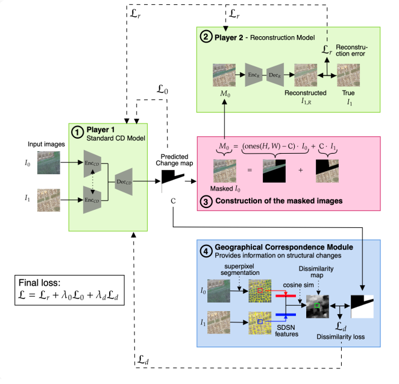

# 2Player: A General Framework for Self-Supervised Change Detection via Cooperative Learning

 [](https://doi.org/add_DOI)


This repository contains the pytorch implementation of the 2Player model from the paper:

**2Player: A General Framework for Self-Supervised Change Detection via Cooperative Learning**  
📄 *ISPRS Journal of Photogrammetry and Remote Sensing*  
🔗 [Read the paper](https://doi.org/add_DOI)
🌐 [Project page](https://manonbechaz.github.io/2Player/)

</br>

<p align="center">
  
</p>


## ⚙️ Requirements

This project is entirely written in Python, primarily using the PyTorch library. All required dependencies can be installed using:

```sh
conda env create -f environment.yaml
```

## 💾 Datasets

This repository supports four datasets used in the paper: two new or improved datasets introduced in this work (HRSCD-Clean and ValaisCD), and two standard benchmarks (LEVIR-CD and WHU-CD).

### 🆕 HRSCD-Clean (introduced in this paper)

We provide a cleaned and refined version of the [original HRSCD](https://rcdaudt.github.io/hrscd/) dataset. 
- Download: [HRSCD-Clean](https://huggingface.co/datasets/EPFL-ECEO/HRSCD_clean)
- Setup: Simply download the dataset and place it under `datasets/HRSCD_clean`

**Pruned subsets:**
We provide multiple pruned versions of HRSCD to mitigate label noise.
Each pruned split is defined by a `.pkl` file listing the retained samples and located in the corresponding folder. When creating the dataset, you can choose the pruned version by specifying the desired `.pkl` file with the `given_list` parameter. 
The 10,000-sample pruned version is the one used in all experiments reported in the paper.

### 🆕 ValaisCD (introduced in this paper)
ValaisCD is a newly introduced high-resolution change detection dataset built from SwissTopo SWISSIMAGE aerial imagery and SwissTLM3D vector maps.
- Download: [ValaisCD](https://huggingface.co/datasets/EPFL-ECEO/ValaisCD)
- Setup: Simply download the dataset and place it under `datasets/ValaisCD`

**Pruned subsets:**
As with HRSCD, we provide several pruned versions of ValaisCD, each defined by a `.pkl` file listing the retained samples. When calling the dataset, you can choose the pruned version by specifying the desired `.pkl` file with the `given_list` parameter. 
The 5,000-sample pruned version is the one used in the paper’s experiments.

### ⭐ LEVIR-CD (public dataset)
- Download: [LEVIR-CD](https://www.kaggle.com/datasets/mdrifaturrahman33/levir-cd)
- Setup: Place the dataset under: `datasets/LEVIRCD`

### ⭐ WHU-CD (public dataset)
- Download: [WHU-CD](https://gpcv.whu.edu.cn/data/building_dataset.html)
- Additional preprocessing required: WHU-CD must be split into non-overlapping 256×256 tiles before use: 
    - Download the dataset from the link above.
    - Tile images into 256×256 patches with no overlap.
    - Place the resulting tiles under `datasets/WHUCD`

## 🏋️ Training 2Player

Training the full 2Player framework involves four main steps:
- Compute dissimilarity maps
- Pretrain Player 2 (reconstruction network)
- Pretrain Player 1 (change detector)
- Joint training of the 2 Players 

Below are the detailed commands and expected outputs for each step.

### 1️⃣ Generating Dissimilarity Maps

Before training, you must generate the dissimilarity maps from the Geographical Correspondence Module by running the following command:

```sh
python compute_probability_of_change_maps.py --dataset <HRSCD or Valais or LEVIR or WHUCD>
```
This script creates dissimilarity maps for every dataset split and stores them under:

```sh
datasets/<DATASET_NAME>/<split>/probability/
```

### 2️⃣ Pretrain Player 2 (Reconstruction Network)

Player 2 is first trained independently for a few epochs to reconstruct the image at $t_1$ from the image at $t_0$. Run:

```sh
python pretrain_Player2.py --dataset <HRSCD or Valais or LEVIR or WHUCD>
```
This will save a pretrained checkpoint under:
```sh
checkpoints/player2/
```

### 3️⃣ Pretrain Player 1 (Change Detection Network) 

Player 1 is then trained for a few epochs with Player 2 frozen. Run:
```sh
python train_2players.py --dataset <HRSCD or Valais or LEVIR or WHUCD> \
     --pretrained_P2 <path-to-pretrained-player2> --alpha <alpha> --beta <beta> \
     --freeze True --epochs 5 --ckpt 0 --P1 <SiamUnet or SNUNet or BIT> --lr <lr>
```
This generates a second checkpoint under:
```sh
checkpoints/2player/
```

### 4️⃣  Joint Training of the Full 2Player Framework

Finally, train the 2 players jointly using 
```sh
python train_2players.py --dataset <HRSCD or Valais or LEVIR or WHUCD> \
     --pretrained_P2 <path-to-pretrained-player2> --alpha <alpha> --beta <beta> \
     --freeze False --epochs <epochs> --ckpt <path-to-pretrained-player1> \
     --P1 <SiamUnet or SNUNet or BIT> --lr <lr>
```
The final model is also saved under:
This generates a second checkpoint under:
```sh
checkpoints/2player/
```

## 🤖 Trained Models

You can download the pretrained model [here](https://huggingface.co/EPFL-ECEO/2Player_pretrained). Place them under `checkpoints/2player` and `checkpoints/player2`. 

Qualitative examples using these pretrained models are presented in `examples.ipynb`.

# 📚 Citation

If you use 2Player or if you find this work helpful, please cite:

```
@article{bechaz_2player_2026,
	title = {{2Player}: {A} general framework for self-supervised change detection via cooperative learning},
	volume = {232},
	issn = {0924-2716},
	url = {https://www.sciencedirect.com/science/article/pii/S0924271625004630},
	doi = {https://doi.org/10.1016/j.isprsjprs.2025.11.024},
	journal = {ISPRS Journal of Photogrammetry and Remote Sensing},
	author = {Béchaz, Manon and Dalsasso, Emanuele and Tomoiagă, Ciprian and Detyniecki, Marcin and Tuia, Devis},
	year = {2026},
	keywords = {Change detection, Cooperative learning, Self-supervised learning, Very high-resolution imagery},
	pages = {34--47},
}

```

```
@inproceedings{bechaz2025self,
  title={Self-supervised Change Detection via Cooperative Learning: A Two-Player Model},
  author={B{\'e}chaz, Manon and Dalsasso, Emanuele and Tomoiag{\u{a}}, Ciprian and Detyniecki, Marcin and Tuia, Devis},
  booktitle={2025 Joint Urban Remote Sensing Event (JURSE)},
  pages={1--4},
  year={2025},
  organization={IEEE},
  doi={10.1109/JURSE60372.2025.11076078}
}
```

